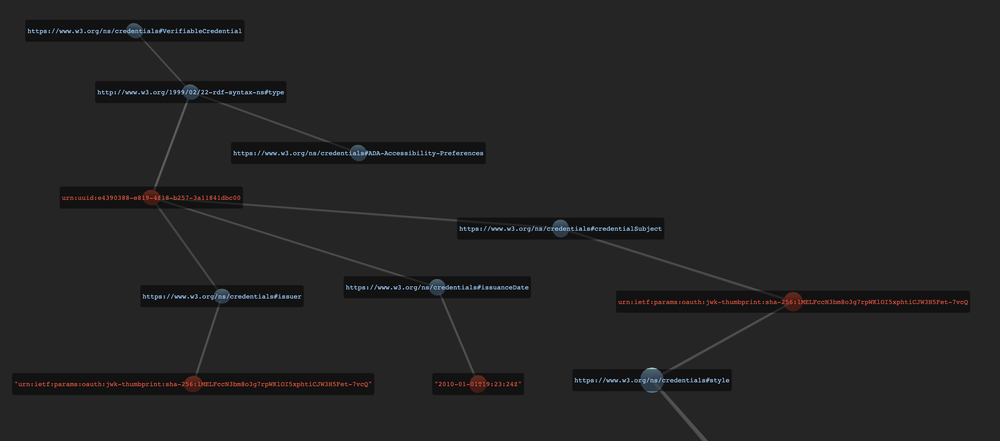

## Authentic User Accessibility Preferences as Verifiable Credentials

This repo contains inspirations from TPAC September 2022.

These are experiments, unsafe for production use.

##### [example verifiable user preferences graph rendering](https://lucid.did.cards/credentials/eyJpc3MiOiJkaWQ6andrOmV5SnJhV1FpT2lKMWNtNDZhV1YwWmpwd1lYSmhiWE02YjJGMWRHZzZhbmRyTFhSb2RXMWljSEpwYm5RNmMyaGhMVEkxTmpveFRVVk1SbU5qVGpOaWJUaHZNMmMzY25CWFMyeFBTVFY0Y0doMGFVTktWek5JTlVabGRDMDNkbU5SSWl3aWEzUjVJam9pUlVNaUxDSmpjbllpT2lKUUxUSTFOaUlzSW1Gc1p5STZJa1ZUTWpVMklpd2llQ0k2SWtnd01sRnBRVkZoYjJ0d2R6RkJRelpsY0RaTVJXTnNNbFJWVEhkcFQwUXhSbFZDWmxwdFpITTBiM01pTENKNUlqb2liV0p3WHpsTFpESkVNWEZKY1VGdlZuZHhkSGcwYTNWWFdUQkVRVGswTlcxV2FXOUhRMlJFZGsxblZTSjkiLCJraWQiOiIjMCIsImFsZyI6IkVTMjU2In0.eyJ2YyI6eyJAY29udGV4dCI6W3siQHZlcnNpb24iOjEuMSwiaWQiOiJAaWQiLCJ0eXBlIjoiQHR5cGUiLCJAdm9jYWIiOiJodHRwczovL3d3dy53My5vcmcvbnMvY3JlZGVudGlhbHMjIiwiY3JlZGVudGlhbFN1YmplY3QiOnsiQHR5cGUiOiJAaWQifX1dLCJpZCI6InVybjp1dWlkOmU0MzkwMzg4LWU4MTktNGYxOC1iMjU3LTNhMTE4NDFkYmMwMCIsInR5cGUiOlsiVmVyaWZpYWJsZUNyZWRlbnRpYWwiLCJBREEtQWNjZXNzaWJpbGl0eS1QcmVmZXJlbmNlcyJdLCJpc3N1ZXIiOiJ1cm46aWV0ZjpwYXJhbXM6b2F1dGg6andrLXRodW1icHJpbnQ6c2hhLTI1NjoxTUVMRmNjTjNibThvM2c3cnBXS2xPSTV4cGh0aUNKVzNINUZldC03dmNRIiwiaXNzdWFuY2VEYXRlIjoiMjAxMC0wMS0wMVQxOToyMzoyNFoiLCJjcmVkZW50aWFsU3ViamVjdCI6eyJpZCI6InVybjppZXRmOnBhcmFtczpvYXV0aDpqd2stdGh1bWJwcmludDpzaGEtMjU2OjFNRUxGY2NOM2JtOG8zZzdycFdLbE9JNXhwaHRpQ0pXM0g1RmV0LTd2Y1EiLCJzdHlsZSI6InAgeyBmb250LXNpemU6IDE1MCUgIWltcG9ydGFudDsgfSJ9fX0.AjKx1XwokVmoz2zDtakrKQBFE4MuSE_IwrMr5i3I1ffWotDt_btwD0R7ItNiIMtEH4T0Io1mprBRmjxNIfEnjg)



#### Injecting Authentic User Preferences in Web Pages

Open [en.wikipedia.org/wiki/Americans_with_Disabilities_Act_of_1990](https://en.wikipedia.org/wiki/Americans_with_Disabilities_Act_of_1990).

Open the Chrome Menu in the upper-right-hand corner of the browser window and select More Tools > Developer Tools.
You can also use Option + ⌘ + J (on macOS), or Shift + CTRL + J (on Windows/Linux).

Paste this into the console while on the page above:

```js
;(() => {
  const vc = {
    '@context': [
      {
        '@version': 1.1,
        id: '@id',
        type: '@type',
        '@vocab': 'https://www.w3.org/ns/credentials#',
        credentialSubject: {
          '@type': '@id',
        },
      },
    ],
    id: 'urn:uuid:e4390388-e819-4f18-b257-3a11841dbc00',
    type: ['VerifiableCredential', 'ADA-Accessibility-Preferences'],
    issuer:
      'urn:ietf:params:oauth:jwk-thumbprint:sha-256:1MELFccN3bm8o3g7rpWKlOI5xphtiCJW3H5Fet-7vcQ',
    issuanceDate: '2010-01-01T19:23:24Z',
    credentialSubject: {
      id: 'urn:ietf:params:oauth:jwk-thumbprint:sha-256:1MELFccN3bm8o3g7rpWKlOI5xphtiCJW3H5Fet-7vcQ',
      style: 'p { font-size: 150% !important; }',
    },
  }
  const style = document.createElement('style')
  style.appendChild(document.createTextNode(vc.credentialSubject.style))
  document.getElementsByTagName('head')[0].appendChild(style)
})()
```

### Want to contribute?

- [W3C Web Accessibility Initiative](https://www.w3.org/WAI/)
- [W3C Verifiable Credentials](https://github.com/w3c/vc-data-model)

### Want to Generate Your Own Credentials?

```
npm i
npm t
```
